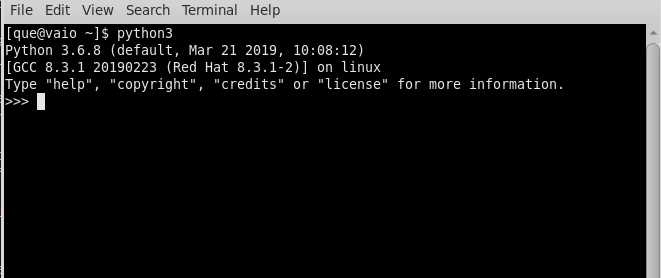
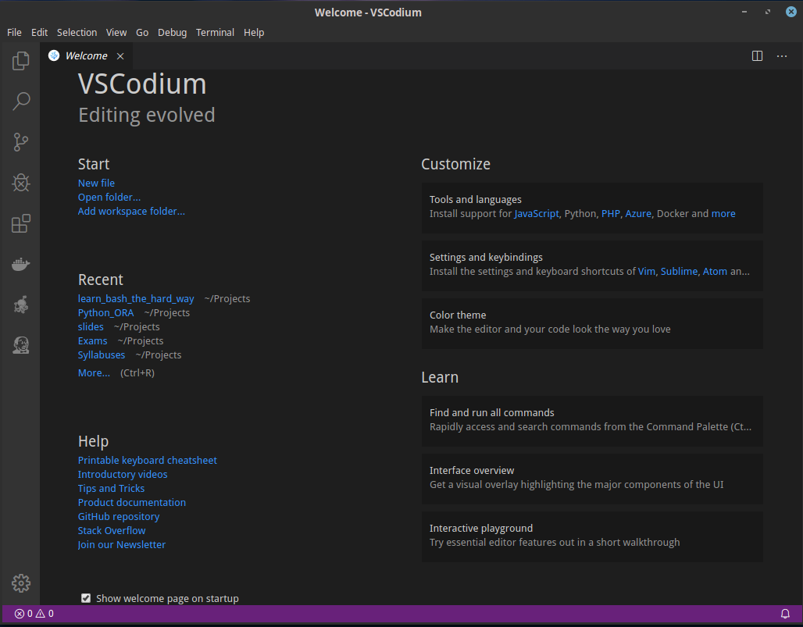

# Python Essentials

<h2 style='background-color:lightgreen'>    
    

        Python 101
    

</h2>

What is a programming language?
Set of conventions for authoring computer programs
What's a program?
A set of instructions for how a computer should react to various inputs and outputs

### History Lesson:
*   Punch cards - [read it for history sake](https://en.wikipedia.org/wiki/Punched_card)
---
*   Assembly language:
    *   Processor specific --> not portable
    *   Binary correspondence
    *   Easier to read than punch cards or binary
    *   more info [here](https://en.wikipedia.org/wiki/Assembly_language)
---
*   "Higher level" languages
      *   Fortran, Cobol, C, C++, C#:
      *   Easier to read and write
      *   Slightly more portable
      *   more infor [here](https://en.wikipedia.org/wiki/High-level_programming_language)
  
---
*    Scripting languages:
     *    JS, Python, Ruby, Groovy, Bash:
     *    more info [here](https://en.wikipedia.org/wiki/Scripting_language)

###   `Types of languages`

*  Compiled Languages:
  -  C, C++, C#, Objective-C
  -  [read about compiler](https://en.wikipedia.org/wiki/Compiler)
*  Scripting languages:
  - Python, Ruby, Javascript, Lua
  - [read about run time environment](https://en.wikipedia.org/wiki/Runtime_system)

### Programming Language Styles

*   Procedural
*   Object Oriented

### Procedural Languages

Procedural programming is a programming paradigm, derived from structured programming,based on the concept of the procedure call. Procedures, also known as routines, subroutines, or functions, simply contain a series of computational steps to be carried out. Any given procedure might be called at any point during a program's execution, including by other procedures or itself.

*   Procedures/Routines/Subroutines/Functions that include series of functions
*   [link](https://en.wikipedia.org/wiki/Procedural_programming)

### Object Oriented Languages
Object-oriented programming (OOP) is a programming paradigm based on the concept of "objects", which can contain data, in the form of fields (often known as attributes or properties), and code, in the form of procedures (often known as methods). A feature of objects is an object's procedures that can access and often modify the data fields of the object with which they are associated (objects have a notion of "this" or "self").

*   Represent objects
*   Define their properties
*   Define ways to manipulate them
*   Object inheritance
*   [link](https://en.wikipedia.org/wiki/Object-oriented_programming)

### REPL: Python Interpreter 
<!-- needs to have explanation-->
As mentioned [before](#types-of-languages) python is interpreted language. The interpretation for this kind of projects is done in a manner of REPL.

Read–eval–print loop (REPL), also termed an interactive toplevel or language shell, is a simple, interactive computer programming environment that takes single user inputs (i.e., single expressions), evaluates (executes) them, and returns the result to the user.

In a REPL, the user enters one or more expressions (rather than an entire compilation unit) and the REPL evaluates them and displays the results. The name read–eval–print loop comes from the names of the Lisp primitive functions which implement this functionality:

The `read` function accepts an expression from the user, and parses it into a data structure in memory. For instance, the user may enter the s-expression (+ 1 2 3), which is parsed into a linked list containing four data elements.

The `eval` function takes this internal data structure and evaluates it. In Lisp, evaluating an s-expression beginning with the name of a function means calling that function on the arguments that make up the rest of the expression. So the function + is called on the arguments 1 2 3, providing (yielding) the result 6.

The `print` function takes the result provided (yielded) by eval, and prints it out to the user. If it is a complex expression, it may be pretty-printed to make it easier to understand.

The development environment then returns to the read state, creating a `loop`, which terminates when the program is closed. 

REPL's are interactive, by which i mean that they interact with the user by success, the command provided to REPL with work or by error, the command will `NOT` work. REPL usually looks same as command line, for example: 

- Open cmd/terminal of your OS
- Type in it `python3` command and you are in
- It should look like this:
  - 
- In case you see  `python 2.7` instead of what you have in picture, then it means that you need to upgrade your current version of python to `python 3.6` or higher.

### Saving the code

Although running in REPL is fun and all, one must always run the list of commands from somewhere, mostly because it misses point of programming if you'll run all the commands manually. 

list of python (or any other high level language) commands that are saved in to the file is usually called as `code`.

To write code, we use a type of `text editor` to write and run it. There are many text editor on www, here is short list of ones that i'd suggest for this course:

- GEANY --> a lightweight IDE for general purpose of development.
  -  
- ATOM --> a extencible text editor with bunch tools that can be added.
  -  
- VSCODIUM --> a clone project of atom and vscode with more native OpenSource licensing and agenda.
  -  